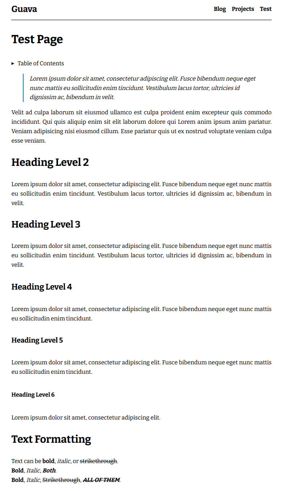

<h1 align="center">🍈 Zola Guava</h1>

<p align="center">
  
  
  
  
  
</p>

## Introduction

Guava is a theme for [Zola](https://www.getzola.org). It is currently a work-in-progress.

Check out the live [Demo](https://miguelpimentel.do/zola-guava/).

## Screenshots




## Features

- Landing page (About page)
- Blog section
- Projects section (with optional project pages)
- Font Awesome Icons (used in the homepage)

## Running the Site Locally

Tips that will help you develop and preview the site locally.

### Requirements

Before using the theme, you need to install [Zola](https://www.getzola.org/documentation/getting-started/installation/) ≥ 0.18.0.

### Quick Start

```bash
# clone the repo
git clone git@github.com:semanticdata/guava.git
# change directory into the cloned folder
cd guava
# serve the site locally
zola serve
# open http://127.0.0.1:1111/ in the browser
```

For more detailed instructions, visit the [Documentation](https://www.getzola.org/documentation/themes/installing-and-using-themes/) page about installing and using themes.

### Useful Commands

A short list of commands that will help you develop your own version of the theme.

| Command                    | Description                |
| -------------------------- | -------------------------- |
| `zola init <my-repo>`      | Initiate new Zola site     |
| `zola build`               | Build only                 |
| `zola serve`               | Build and Serve            |

## Customization

You can changed the configuration, templates and content yourself. Refer to the `config.toml`, and templates files for ideas. In most cases you only need to modify the contents of `config.toml` to customize the appearance of your blog. Make sure to visit tyhe [Zola Documentation](https://www.getzola.org/documentation/getting-started/overview/).

### Custom CSS Styles

Adding custom CSS is as easy as adding your styles to `sass/_custom.scss`. This is made possible because SCSS files are backwards compatible with CSS. This means you can type normal CSS code into a SCSS file and it will be valid.

## Reporting Issues

We use GitHub Issues as the official bug tracker for **Guava**. Please
search [existing issues](https://github.com/semanticdata/guava/issues). It’s
possible someone has already reported the same problem.

If your problem or idea is not addressed yet, [open a new issue](https://github.com/semanticdata/guava/issues/new).

## Contributing

We'd love your help! Please see [CONTRIBUTING](./CONTRIBUTING.md) to learn about the kinds of contributions we're looking for.

Please read and be aware of the [Code of Conduct](.github/CODE_OF_CONDUCT.md) before conttributing.

## Acknowledgements and Attributions

The icons used throughout the site are kindly provided by [UXWing](https://uxwing.com/license/). Read their [license](https://uxwing.com/license/).

Other icons used come from [Remix Icon](https://remixicon.com/). Check out their [license](https://remixicon.com/license).

## License

Source code in this repository is available under the [MIT](LICENSE) license. You are free to use this code however you like. That said, some acknowledgement would be well received.
